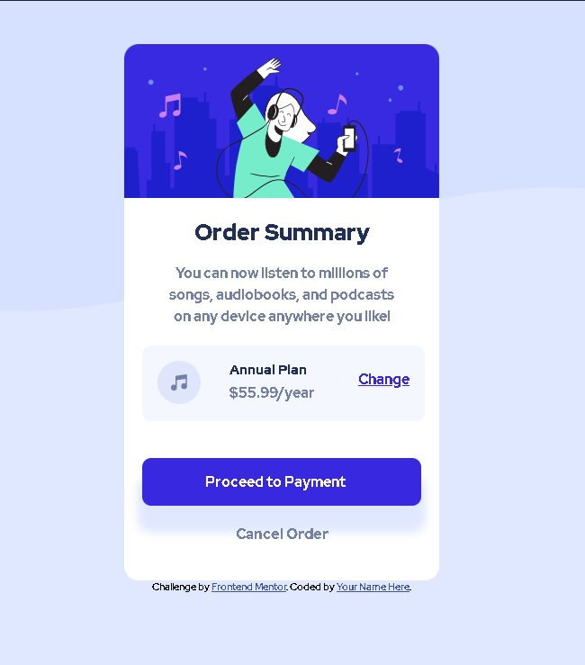

# Frontend Mentor - Order summary card solution

This is a solution to the [Order summary card challenge on Frontend Mentor](https://www.frontendmentor.io/challenges/order-summary-component-QlPmajDUj). Frontend Mentor challenges help you improve your coding skills by building realistic projects. 

## Table of contents

- [Overview](#overview)
  - [The challenge](#the-challenge)
  - [Screenshot](#screenshot)
  - [Links](#links)
- [My process](#my-process)
  - [Built with](#built-with)
  - [What I learned](#what-i-learned)
  - [Useful resources](#useful-resources)
- [Author](#author)

## Overview

### The challenge

Users should be able to:

- See hover states for interactive elements

### Screenshot

### Links

- Live Site URL: [Add live site URL here](https://flamboyant-mestorf-66c037.netlify.app/)

## My process
Used Viual studio code to build this website from a design i was given bt Front end Mentor.

### Built with

- Semantic HTML5 markup
- CSS custom properties
- Flexbox
- CSS Grid

### What I learned

!important to keep in mid always, dont forget to assign template areas to what you want to be inside. For example img add

.grid img{
  grid-area: img;
} 

and that should do it.

Css Grid:

.grid{
  display: grid;
  height: 2.5rem;
  grid-template-columns: .5fr .9fr 0.1fr;
  grid-template-rows: 1fr 1fr;
  grid-template-areas: 
  "img p1 a"
  "img p2 a";
  background-color: var(--bs-veryPaleBlue);
  padding: 17px;
  border-radius: .5rem;
}

### Useful resources

- [Example resource 1](https://developer.mozilla.org/en-US/) - This helped with some syntax and Values i needed to remember.
- [Example resource 2](https://www.w3schools.com/) - This helped with some syntax and Values i needed to remember..

## Author

- Website - [Marco](https://github.com/darkmagic2)
- Frontend Mentor - [@darkmagic2](https://www.frontendmentor.io/profile/darkmagic2)

